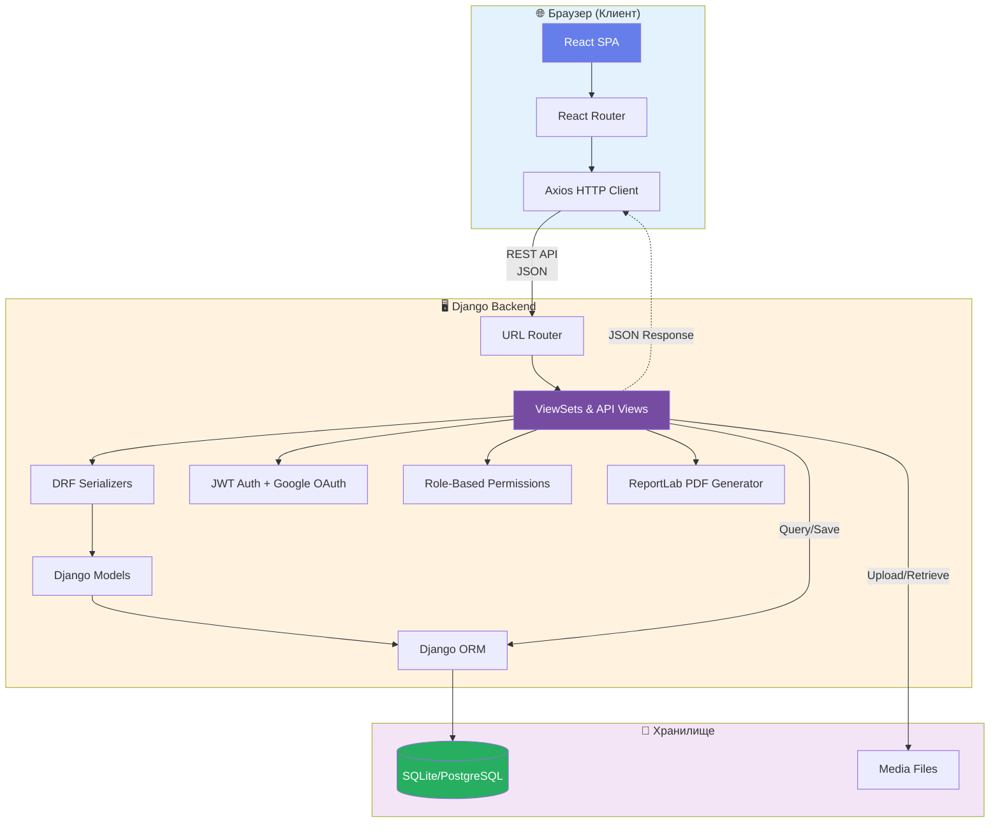
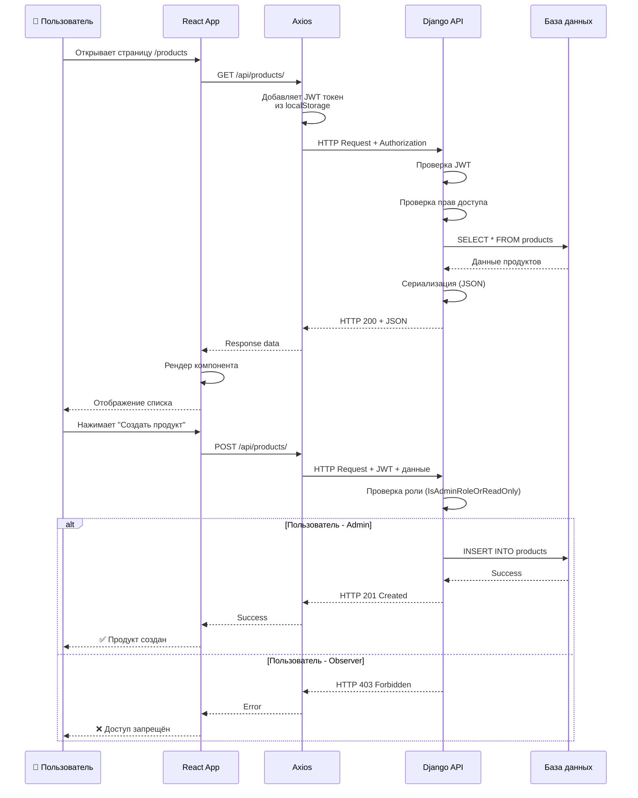
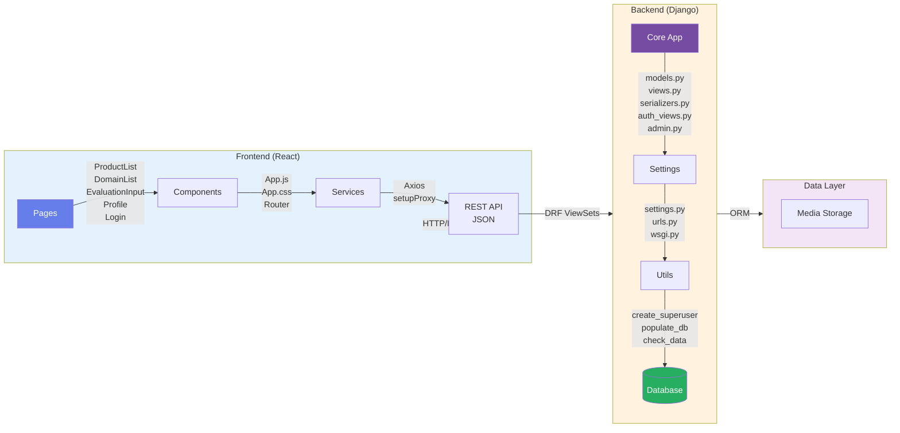
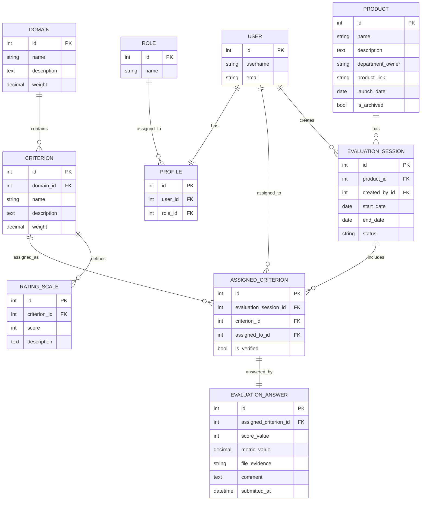

# 🎯 Система оценки зрелости цифровых продуктов региона

Информационная система для оценки зрелости цифровых продуктов региона с веб-интерфейсом на Django (backend) и React (frontend).

## 📋 Функциональные возможности

### Управление продуктами
- Создание, редактирование и архивирование карточек продуктов
- Атрибуты: название, описание, владелец, ссылка, дата запуска

### Конструктор модели оценки
- Настройка иерархической модели оценки (домены → критерии)
- Веса для доменов и критериев
- Шкала оценки 1-10 с текстовыми описаниями

### Сессии оценки
- Инициация оценок для продуктов
- Динамические анкеты на основе модели критериев
- Частичное сохранение (можно заполнять постепенно)
- Статусы: В ожидании → В процессе → Завершено

### Расчёт и визуализация
- Автоматический расчёт индекса зрелости с учётом весов
- Интерактивные дашборды (радарный, столбчатый, круговой графики)

### Отчётность
- PDF-паспорт зрелости продукта (на русском языке)
- Сводный отчёт по портфелю продуктов

### Пользователи и роли
- Регистрация и авторизация
- Профили пользователей
- Роли: Администратор, Эксперт, Владелец продукта, Наблюдатель

---

## 🏗 Архитектура приложения

### Общая схема архитектуры

```
┌─────────────────────────────────────────────────────────────────────────────┐
│                              КЛИЕНТ (Браузер)                               │
│                                                                             │
│  ┌─────────────────────────────────────────────────────────────────────┐   │
│  │                         React Frontend                               │   │
│  │  ┌──────────┐ ┌──────────┐ ┌──────────┐ ┌──────────┐ ┌──────────┐  │   │
│  │  │ProductList│ │DomainList│ │Evaluation│ │ Results  │ │ Profile  │  │   │
│  │  │          │ │          │ │  Input   │ │Dashboard │ │          │  │   │
│  │  └──────────┘ └──────────┘ └──────────┘ └──────────┘ └──────────┘  │   │
│  │                              │                                       │   │
│  │                    ┌─────────▼─────────┐                            │   │
│  │                    │   React Router    │                            │   │
│  │                    │    + Axios        │                            │   │
│  │                    └─────────┬─────────┘                            │   │
│  └──────────────────────────────┼──────────────────────────────────────┘   │
└─────────────────────────────────┼───────────────────────────────────────────┘
                                  │ HTTP/REST API
                                  │ JSON
┌─────────────────────────────────▼───────────────────────────────────────────┐
│                              СЕРВЕР                                         │
│                                                                             │
│  ┌─────────────────────────────────────────────────────────────────────┐   │
│  │                      Django Backend                                  │   │
│  │                                                                      │   │
│  │  ┌────────────────┐  ┌────────────────┐  ┌────────────────┐        │   │
│  │  │   URL Router   │  │   Views/API    │  │  Serializers   │        │   │
│  │  │   (urls.py)    │──│  (views.py)    │──│(serializers.py)│        │   │
│  │  └────────────────┘  └───────┬────────┘  └────────────────┘        │   │
│  │                              │                                       │   │
│  │  ┌────────────────┐  ┌───────▼────────┐  ┌────────────────┐        │   │
│  │  │   Auth Views   │  │    Models      │  │    Signals     │        │   │
│  │  │(auth_views.py) │  │  (models.py)   │  │  (signals.py)  │        │   │
│  │  └────────────────┘  └───────┬────────┘  └────────────────┘        │   │
│  │                              │                                       │   │
│  │  ┌────────────────┐  ┌───────▼────────┐  ┌────────────────┐        │   │
│  │  │  PDF Generator │  │  Django ORM    │  │   Migrations   │        │   │
│  │  │  (ReportLab)   │  │                │  │                │        │   │
│  │  └────────────────┘  └───────┬────────┘  └────────────────┘        │   │
│  └──────────────────────────────┼──────────────────────────────────────┘   │
│                                 │                                           │
│  ┌──────────────────────────────▼──────────────────────────────────────┐   │
│  │                        База данных                                   │   │
│  │                  SQLite / PostgreSQL                                 │   │
│  └─────────────────────────────────────────────────────────────────────┘   │
└─────────────────────────────────────────────────────────────────────────────┘
```

### Архитектура компонентов

```
┌───────────────────────────────────────────────────────────────────────┐
│                        FRONTEND (React)                               │
├───────────────────────────────────────────────────────────────────────┤
│                                                                       │
│   Pages (Страницы)              Components (Компоненты)               │
│   ├── ProductList.js            ├── App.js (главный)                 │
│   ├── ProductForm.js            ├── App.css (стили)                  │
│   ├── ProductDetail.js          └── setupProxy.js                    │
│   ├── DomainList.js                                                  │
│   ├── DomainForm.js             Services (Сервисы)                   │
│   ├── CriterionList.js          └── Axios (HTTP клиент)              │
│   ├── CriterionForm.js                                               │
│   ├── EvaluationSessionList.js  Visualization (Визуализация)         │
│   ├── EvaluationSessionForm.js  └── Chart.js (графики)               │
│   ├── EvaluationInput.js                                             │
│   ├── EvaluationResults.js                                           │
│   ├── Login.js                                                       │
│   ├── Register.js                                                    │
│   └── Profile.js                                                     │
│                                                                       │
└───────────────────────────────────────────────────────────────────────┘

┌───────────────────────────────────────────────────────────────────────┐
│                        BACKEND (Django)                               │
├───────────────────────────────────────────────────────────────────────┤
│                                                                       │
│   Core App                      Settings                              │
│   ├── models.py (8 моделей)     ├── settings.py                      │
│   ├── views.py (ViewSets)       ├── urls.py                          │
│   ├── serializers.py            └── wsgi.py / asgi.py                │
│   ├── urls.py (API routes)                                           │
│   ├── signals.py                Utils                                 │
│   ├── auth_views.py             ├── create_superuser.py              │
│   ├── admin.py                  ├── populate_db.py                   │
│   └── apps.py                   └── check_data.py                    │
│                                                                       │
└───────────────────────────────────────────────────────────────────────┘
```

### Паттерн взаимодействия (Request Flow)

```
┌────────┐    ┌────────┐    ┌────────┐    ┌────────┐    ┌────────┐
│ Browser│───▶│ React  │───▶│ Axios  │───▶│ Django │───▶│  DB    │
│        │    │  App   │    │ HTTP   │    │  API   │    │        │
└────────┘    └────────┘    └────────┘    └────────┘    └────────┘
     ▲                                          │
     │              JSON Response               │
     └──────────────────────────────────────────┘
```

### Архитектура приложения (Mermaid)



### Поток запроса (Sequence Diagram)



### Архитектура компонентов (Mermaid)



---

## 🗄 Структура базы данных

### ER-диаграмма (Entity Relationship)

```
Product (1) --------------------< (N) EvaluationSession >-------------------- (1) User [created_by, SET_NULL]
  id PK                               id PK                                         id PK
  name                                product_id FK -> Product.id                  username, email, ...
  description                         created_by_id FK -> User.id (nullable)
  department_owner                    start_date, end_date, status
  product_link
  launch_date
  is_archived

Domain (1) ---------------------< (N) Criterion (1) ------------------------< (N) RatingScale
  id PK                               id PK                                       id PK
  name                                domain_id FK -> Domain.id                   criterion_id FK -> Criterion.id
  description                         name, description, weight                   score (1..10), description
  weight

EvaluationSession (1) ----------< (N) AssignedCriterion >------------------- (1) Criterion
                                    id PK                                         id PK
                                    evaluation_session_id FK -> EvaluationSession.id
                                    criterion_id FK -> Criterion.id
                                    assigned_to_id FK -> User.id (nullable, SET_NULL)
                                    is_verified
                                    UNIQUE(evaluation_session_id, criterion_id)

AssignedCriterion (1) ---------- (1) EvaluationAnswer
                                   id PK
                                   assigned_criterion_id FK UNIQUE -> AssignedCriterion.id
                                   score_value, metric_value, file_evidence, comment, submitted_at

User (1) ------------------------ (1) Profile >------------------------------ (N) Role
  id PK                              id PK                                        id PK
  username, email, ...               user_id FK UNIQUE -> User.id                 name (admin|expert|owner|observer)
                                    role_id FK -> Role.id (nullable, SET_NULL)
```

### ER-диаграмма (Mermaid)



### Кардинальности и правила связей

- `Product 1:N EvaluationSession` — у продукта может быть много сессий оценки.
- `Domain 1:N Criterion` — каждый критерий принадлежит ровно одному домену.
- `Criterion 1:N RatingScale` — у критерия несколько уровней шкалы.
- `EvaluationSession N:M Criterion` реализовано через `AssignedCriterion`.
- `AssignedCriterion 1:1 EvaluationAnswer` — на один назначенный критерий максимум один ответ.
- `User 1:N EvaluationSession` через `created_by` (`SET_NULL` при удалении пользователя).
- `User 1:N AssignedCriterion` через `assigned_to` (`SET_NULL` при удалении пользователя).
- `User 1:1 Profile` — профиль создается для каждого пользователя.
- `Role 1:N Profile` — роль может быть назначена многим пользователям; роль в профиле может быть `NULL`.

### Описание таблиц

#### Product (Цифровой продукт)
| Поле | Тип | Описание |
|------|-----|----------|
| id | INTEGER | Первичный ключ (AUTO) |
| name | VARCHAR(255) | Название продукта |
| description | TEXT | Описание продукта |
| department_owner | VARCHAR(255) | Владелец/ведомство |
| product_link | URL | Ссылка на продукт |
| launch_date | DATE | Дата запуска |
| is_archived | BOOLEAN | Флаг архивации |

#### Domain (Домен оценки)
| Поле | Тип | Описание |
|------|-----|----------|
| id | INTEGER | Первичный ключ (AUTO) |
| name | VARCHAR(255) | Название домена (уникальное) |
| description | TEXT | Описание домена |
| weight | DECIMAL(5,2) | Вес в общем индексе (0.01-100%) |

#### Criterion (Критерий оценки)
| Поле | Тип | Описание |
|------|-----|----------|
| id | INTEGER | Первичный ключ (AUTO) |
| domain_id | FK → Domain | Внешний ключ на домен |
| name | VARCHAR(255) | Название критерия |
| description | TEXT | Описание критерия |
| weight | DECIMAL(5,2) | Вес в домене (0.01-100%) |

#### RatingScale (Шкала оценки)
| Поле | Тип | Описание |
|------|-----|----------|
| id | INTEGER | Первичный ключ (AUTO) |
| criterion_id | FK → Criterion | Внешний ключ на критерий |
| score | INTEGER | Балл (1-10) |
| description | TEXT | Текстовое описание балла |

#### EvaluationSession (Сессия оценки)
| Поле | Тип | Описание |
|------|-----|----------|
| id | INTEGER | Первичный ключ (AUTO) |
| product_id | FK → Product | Оцениваемый продукт |
| created_by | FK → User | Создатель сессии |
| start_date | DATE | Дата начала (AUTO) |
| end_date | DATE | Дата завершения |
| status | VARCHAR(50) | pending/in_progress/completed/archived |

#### AssignedCriterion (Назначенный критерий)
| Поле | Тип | Описание |
|------|-----|----------|
| id | INTEGER | Первичный ключ (AUTO) |
| evaluation_session_id | FK → EvaluationSession | Сессия оценки |
| criterion_id | FK → Criterion | Критерий |
| assigned_to | FK → User | Ответственный |
| is_verified | BOOLEAN | Флаг верификации |

#### EvaluationAnswer (Ответ на оценку)
| Поле | Тип | Описание |
|------|-----|----------|
| id | INTEGER | Первичный ключ (AUTO) |
| assigned_criterion_id | FK → AssignedCriterion | Назначенный критерий (1:1) |
| score_value | INTEGER | Балл (1-10) |
| metric_value | DECIMAL(10,2) | Числовая метрика |
| file_evidence | FILE | Файл-доказательство |
| comment | TEXT | Комментарий |
| submitted_at | DATETIME | Дата отправки (AUTO) |

#### Role (Роль пользователя)
| Поле | Тип | Описание |
|------|-----|----------|
| id | INTEGER | Первичный ключ (AUTO) |
| name | VARCHAR(50) | admin/expert/owner/observer |

#### Profile (Профиль пользователя)
| Поле | Тип | Описание |
|------|-----|----------|
| id | INTEGER | Первичный ключ (AUTO) |
| user_id | FK → User | Пользователь Django (1:1) |
| role_id | FK → Role | Роль пользователя |

---

## 🛠 Стек технологий

### Backend

| Технология | Версия | Назначение |
|------------|--------|------------|
| **Python** | 3.11+ | Язык программирования |
| **Django** | 4.2+ | Web-фреймворк |
| **Django REST Framework** | 3.14+ | REST API |
| **djangorestframework-simplejwt** | 5.3+ | JWT аутентификация |
| **django-cors-headers** | 4.3+ | CORS для API |
| **django-allauth** | 0.58+ | Расширенная аутентификация |
| **dj-rest-auth** | 5.0+ | REST API для auth |
| **ReportLab** | 4.0+ | Генерация PDF |
| **SQLite** | 3 | БД для разработки |
| **PostgreSQL** | 15+ | БД для production |
| **Gunicorn** | 21+ | WSGI сервер |

### Frontend

| Технология | Версия | Назначение |
|------------|--------|------------|
| **React** | 18+ | UI библиотека |
| **React Router DOM** | 6+ | Маршрутизация SPA |
| **Axios** | 1.6+ | HTTP клиент |
| **Chart.js** | 4+ | Библиотека графиков |
| **react-chartjs-2** | 5+ | React обёртка для Chart.js |
| **Font Awesome** | 6+ | Иконки |
| **CSS3** | - | Стилизация (градиенты, анимации) |

### DevOps / Инфраструктура

| Технология | Назначение |
|------------|------------|
| **Docker** | Контейнеризация |
| **Docker Compose** | Оркестрация контейнеров |
| **Git** | Контроль версий |
| **GitHub** | Хостинг репозитория |
| **npm** | Пакетный менеджер (frontend) |
| **pip** | Пакетный менеджер (backend) |

### Архитектурные паттерны

| Паттерн | Применение |
|---------|------------|
| **MVC/MVT** | Django (Model-View-Template) |
| **REST API** | Взаимодействие frontend-backend |
| **SPA** | Single Page Application (React) |
| **JWT** | Stateless аутентификация |
| **ORM** | Django ORM для работы с БД |
| **Signals** | Django signals для событий |
| **ViewSet** | DRF ViewSets для CRUD API |

---

## 📁 Структура проекта

```
digital_product_maturity_system/
├── backend/
│   ├── digital_product_maturity_project/
│   │   ├── digital_product_maturity/
│   │   │   ├── core/                    # Основное приложение
│   │   │   │   ├── migrations/          # Миграции БД
│   │   │   │   ├── __init__.py
│   │   │   │   ├── admin.py             # Django Admin
│   │   │   │   ├── apps.py              # Конфигурация приложения
│   │   │   │   ├── auth_views.py        # Аутентификация API
│   │   │   │   ├── models.py            # Модели данных (8 моделей)
│   │   │   │   ├── serializers.py       # DRF сериализаторы
│   │   │   │   ├── signals.py           # Django signals
│   │   │   │   ├── urls.py              # URL маршруты API
│   │   │   │   └── views.py             # ViewSets и actions
│   │   │   ├── __init__.py
│   │   │   ├── asgi.py
│   │   │   ├── settings.py              # Настройки Django
│   │   │   ├── urls.py                  # Главные URL
│   │   │   └── wsgi.py
│   │   ├── manage.py
│   │   ├── create_superuser.py          # Создание админа
│   │   ├── populate_db.py               # Наполнение тестовыми данными
│   │   └── check_data.py                # Проверка данных
│   ├── requirements.txt                 # Python зависимости
│   ├── Dockerfile
│   └── .dockerignore
├── frontend/
│   ├── public/
│   │   ├── index.html
│   │   ├── favicon.ico
│   │   └── manifest.json
│   ├── src/
│   │   ├── pages/                       # Страницы приложения
│   │   │   ├── ProductList.js           # Список продуктов
│   │   │   ├── ProductForm.js           # Форма продукта
│   │   │   ├── ProductDetail.js         # Детали продукта
│   │   │   ├── DomainList.js            # Список доменов
│   │   │   ├── DomainForm.js            # Форма домена
│   │   │   ├── CriterionList.js         # Список критериев
│   │   │   ├── CriterionForm.js         # Форма критерия
│   │   │   ├── EvaluationSessionList.js # Список сессий
│   │   │   ├── EvaluationSessionForm.js # Создание сессии
│   │   │   ├── EvaluationInput.js       # Ввод оценок
│   │   │   ├── EvaluationResults.js     # Результаты + графики
│   │   │   ├── Login.js                 # Вход
│   │   │   ├── Register.js              # Регистрация
│   │   │   └── Profile.js               # Профиль
│   │   ├── components/
│   │   │   └── RatingScaleForm.js
│   │   ├── App.js                       # Главный компонент
│   │   ├── App.css                      # Глобальные стили
│   │   ├── index.js                     # Точка входа
│   │   └── setupProxy.js                # Proxy для API
│   ├── package.json
│   ├── Dockerfile
│   └── .dockerignore
├── docker-compose.yml                   # Docker конфигурация
├── start_local.bat                      # Скрипт локального запуска
├── .gitignore
└── README.md
```

---

## 🔌 API Endpoints

| Метод | URL | Описание |
|-------|-----|----------|
| GET/POST | `/api/products/` | Список/создание продуктов |
| GET/PUT/DELETE | `/api/products/{id}/` | Операции с продуктом |
| GET/POST | `/api/domains/` | Список/создание доменов |
| GET/POST | `/api/criteria/` | Список/создание критериев |
| GET/POST | `/api/rating-scales/` | Шкалы оценки |
| GET/POST | `/api/evaluation-sessions/` | Сессии оценки |
| GET | `/api/evaluation-sessions/{id}/get_overall_maturity_index/` | Индекс зрелости |
| GET | `/api/evaluation-sessions/{id}/get_domain_scores/` | Оценки по доменам |
| GET | `/api/evaluation-sessions/{id}/generate_maturity_passport/` | PDF паспорт |
| GET/POST | `/api/assigned-criteria/` | Назначенные критерии |
| GET/POST | `/api/evaluation-answers/` | Ответы на оценку |
| POST | `/api/auth/login/` | Вход |
| POST | `/api/auth/register/` | Регистрация |
| GET | `/api/auth/user/` | Текущий пользователь |

---

## 📈 Расчёт индекса зрелости

```
Индекс домена = Σ(оценка_критерия × вес_критерия) / Σ(веса_критериев)

Общий индекс = Σ(индекс_домена × вес_домена) / Σ(веса_доменов)
```

**Уровни зрелости:**
- 🌟 **Превосходный** (8-10)
- ⭐ **Высокий** (6-8)
- 💫 **Средний** (4-6)
- ⚠️ **Низкий** (2-4)
- ❌ **Критический** (0-2)

---

## 🚀 Быстрый старт

### Локальный запуск

```bash
# Backend
cd backend/digital_product_maturity_project
pip install -r ../requirements.txt
python manage.py migrate
python create_superuser.py
python populate_db.py
python manage.py runserver

# Frontend (в другом терминале)
cd frontend
npm install
npm start
```

### Docker Compose

```bash
docker-compose up --build
```

**Доступ:**
- Frontend: http://localhost:3000
- Backend API: http://localhost:8000/api/
- Логин: `admin` / Пароль: `admin123`

---

## 📄 Лицензия

MIT License

## 👨‍💻 Автор

Система разработана для оценки зрелости цифровых продуктов региона.
