# 🎯 Система оценки зрелости цифровых продуктов региона

Информационная система для оценки зрелости цифровых продуктов региона с веб-интерфейсом на Django (backend) и React (frontend).

## 📋 Функциональные возможности

### Управление продуктами
- Создание, редактирование и архивирование карточек продуктов
- Атрибуты: название, описание, владелец, ссылка, дата запуска

### Конструктор модели оценки
- Настройка иерархической модели оценки (домены → критерии)
- Веса для доменов и критериев
- Шкала оценки 1-10 с текстовыми описаниями

### Сессии оценки
- Инициация оценок для продуктов
- Динамические анкеты на основе модели критериев
- Частичное сохранение (можно заполнять постепенно)
- Статусы: В ожидании → В процессе → Завершено

### Расчёт и визуализация
- Автоматический расчёт индекса зрелости с учётом весов
- Интерактивные дашборды (радарный, столбчатый, круговой графики)

### Отчётность
- PDF-паспорт зрелости продукта (на русском языке)
- Сводный отчёт по портфелю продуктов

### Пользователи и роли
- Регистрация и авторизация
- Профили пользователей
- Роли: Администратор, Эксперт, Владелец продукта, Наблюдатель

---

## 🏗 Архитектура приложения

### 🧱 Стиль архитектуры — Modular Monolith + SPA frontend

Приложение спроектировано как **монолитный backend** на Django + REST API и **отдельный SPA-фронтенд** на React. В литературе такой стиль называют **«headless monolith»** или **«decoupled monolith»** — это **не микросервисы**, а «толстый» монолит, у которого UI вынесен в отдельное JS-приложение и общается с ядром только по REST/JSON.

**Почему именно монолит, а не микросервисы:**

| Критерий | Решение и обоснование |
|---|---|
| **Масштаб команды** | 1–2 разработчика — микросервисы дают больше операционных издержек, чем выгод. |
| **Нагрузка** | Внутренний инструмент оценки (десятки–сотни оценок в день) — одного процесса Django более чем достаточно. |
| **Транзакционность** | Расчёт интегральных индексов и сохранение ответов должны быть в одной транзакции БД — в монолите это бесплатно, в микросервисах потребовало бы Saga / 2PC. |
| **Стоимость инфраструктуры** | Один контейнер backend + один контейнер БД vs. 5–7 сервисов + брокер сообщений + service mesh. |
| **Скорость релизов** | Один `docker compose up` — никаких распределённых деплоев. |
| **Целостность модели данных** | Все доменные сущности (Product, Domain, Criterion, Session, Answer, User) ссылаются друг на друга через FK — единая БД упрощает целостность. |

**Состав системы (фактический):**

- **Backend** — один Django-проект `digital_product_maturity_project` с одним Django-приложением `core`, в котором размещены **все** доменные модули: каталог продуктов, конструктор модели оценки, проведение сессий, расчёт индексов, генерация PDF, аутентификация, RBAC, аудит. Один процесс — одна БД (PostgreSQL/SQLite).
- **Frontend** — React SPA (`frontend/`), общающийся с backend через `axios` по REST + JWT.
- **БД** — PostgreSQL (prod) или SQLite (dev), общая для всего домена.
- **Внешние сервисы** — только Google OAuth 2.0 для социального логина.

**Применённые архитектурные паттерны внутри монолита:**

- **MVC / MVT** — стандартный Django-паттерн (Model–View–Template, в нашем случае Template = DRF Serializer).
- **Repository через ORM** — доступ к данным только через Django ORM, никаких сырых SQL.
- **DTO через DRF Serializers** — внешний контракт API изолирован от моделей.
- **RBAC через Permission classes** — `CatalogPermission`, `ProductPermission`, `EvaluationPermission` (см. `core/views.py`).
- **Signals** для побочных эффектов (создание `Profile` при создании `User`).

**Готовность к эволюции (если когда-то понадобятся микросервисы):**

Сейчас всё бизнес-приложение лежит в одной Django-app `core`. Чтобы превратить его в **модульный монолит** (промежуточный шаг перед микросервисами), достаточно разнести `core` на 5 Django-apps:

```text
core/  →  products/        (каталог)
          model_builder/   (домены, критерии, шкалы)
          evaluations/     (сессии, ответы, расчёт индексов)
          reporting/       (PDF, графики, дашборд)
          accounts/        (User, Profile, RBAC, Google OAuth)
```

После такого разделения границы доменов становятся явными, и в будущем любой модуль (например, `reporting` с `matplotlib` и Celery) можно вынести в самостоятельный сервис без переписывания остального кода.

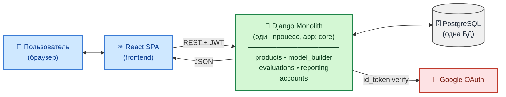

**Вывод:** для текущего масштаба и команды — **монолит — правильный выбор**. Архитектура спроектирована так, чтобы при росте нагрузки её можно было плавно превратить в модульный монолит, а затем — точечно вынести нужные модули в сервисы, не переписывая всё.

---

### Общая схема архитектуры

```
┌─────────────────────────────────────────────────────────────────────────────┐
│                              КЛИЕНТ (Браузер)                               │
│                                                                             │
│  ┌─────────────────────────────────────────────────────────────────────┐   │
│  │                         React Frontend                               │   │
│  │  ┌──────────┐ ┌──────────┐ ┌──────────┐ ┌──────────┐ ┌──────────┐  │   │
│  │  │ProductList│ │DomainList│ │Evaluation│ │ Results  │ │ Profile  │  │   │
│  │  │          │ │          │ │  Input   │ │Dashboard │ │          │  │   │
│  │  └──────────┘ └──────────┘ └──────────┘ └──────────┘ └──────────┘  │   │
│  │                              │                                       │   │
│  │                    ┌─────────▼─────────┐                            │   │
│  │                    │   React Router    │                            │   │
│  │                    │    + Axios        │                            │   │
│  │                    └─────────┬─────────┘                            │   │
│  └──────────────────────────────┼──────────────────────────────────────┘   │
└─────────────────────────────────┼───────────────────────────────────────────┘
                                  │ HTTP/REST API
                                  │ JSON
┌─────────────────────────────────▼───────────────────────────────────────────┐
│                              СЕРВЕР                                         │
│                                                                             │
│  ┌─────────────────────────────────────────────────────────────────────┐   │
│  │                      Django Backend                                  │   │
│  │                                                                      │   │
│  │  ┌────────────────┐  ┌────────────────┐  ┌────────────────┐        │   │
│  │  │   URL Router   │  │   Views/API    │  │  Serializers   │        │   │
│  │  │   (urls.py)    │──│  (views.py)    │──│(serializers.py)│        │   │
│  │  └────────────────┘  └───────┬────────┘  └────────────────┘        │   │
│  │                              │                                       │   │
│  │  ┌────────────────┐  ┌───────▼────────┐  ┌────────────────┐        │   │
│  │  │   Auth Views   │  │    Models      │  │    Signals     │        │   │
│  │  │(auth_views.py) │  │  (models.py)   │  │  (signals.py)  │        │   │
│  │  └────────────────┘  └───────┬────────┘  └────────────────┘        │   │
│  │                              │                                       │   │
│  │  ┌────────────────┐  ┌───────▼────────┐  ┌────────────────┐        │   │
│  │  │  PDF Generator │  │  Django ORM    │  │   Migrations   │        │   │
│  │  │  (ReportLab)   │  │                │  │                │        │   │
│  │  └────────────────┘  └───────┬────────┘  └────────────────┘        │   │
│  └──────────────────────────────┼──────────────────────────────────────┘   │
│                                 │                                           │
│  ┌──────────────────────────────▼──────────────────────────────────────┐   │
│  │                        База данных                                   │   │
│  │                  SQLite / PostgreSQL                                 │   │
│  └─────────────────────────────────────────────────────────────────────┘   │
└─────────────────────────────────────────────────────────────────────────────┘
```

### Архитектура компонентов

```
┌───────────────────────────────────────────────────────────────────────┐
│                        FRONTEND (React)                               │
├───────────────────────────────────────────────────────────────────────┤
│                                                                       │
│   Pages (Страницы)              Components (Компоненты)               │
│   ├── ProductList.js            ├── App.js (главный)                 │
│   ├── ProductForm.js            ├── App.css (стили)                  │
│   ├── ProductDetail.js          └── setupProxy.js                    │
│   ├── DomainList.js                                                  │
│   ├── DomainForm.js             Services (Сервисы)                   │
│   ├── CriterionList.js          └── Axios (HTTP клиент)              │
│   ├── CriterionForm.js                                               │
│   ├── EvaluationSessionList.js  Visualization (Визуализация)         │
│   ├── EvaluationSessionForm.js  └── Chart.js (графики)               │
│   ├── EvaluationInput.js                                             │
│   ├── EvaluationResults.js                                           │
│   ├── Login.js                                                       │
│   ├── Register.js                                                    │
│   └── Profile.js                                                     │
│                                                                       │
└───────────────────────────────────────────────────────────────────────┘

┌───────────────────────────────────────────────────────────────────────┐
│                        BACKEND (Django)                               │
├───────────────────────────────────────────────────────────────────────┤
│                                                                       │
│   Core App                      Settings                              │
│   ├── models.py (8 моделей)     ├── settings.py                      │
│   ├── views.py (ViewSets)       ├── urls.py                          │
│   ├── serializers.py            └── wsgi.py / asgi.py                │
│   ├── urls.py (API routes)                                           │
│   ├── signals.py                Utils                                 │
│   ├── auth_views.py             ├── create_superuser.py              │
│   ├── admin.py                  ├── populate_db.py                   │
│   └── apps.py                   └── check_data.py                    │
│                                                                       │
└───────────────────────────────────────────────────────────────────────┘
```

### Паттерн взаимодействия (Request Flow)

```
┌────────┐    ┌────────┐    ┌────────┐    ┌────────┐    ┌────────┐
│ Browser│───▶│ React  │───▶│ Axios  │───▶│ Django │───▶│  DB    │
│        │    │  App   │    │ HTTP   │    │  API   │    │        │
└────────┘    └────────┘    └────────┘    └────────┘    └────────┘
     ▲                                          │
     │              JSON Response               │
     └──────────────────────────────────────────┘
```

### Архитектура приложения (Mermaid)

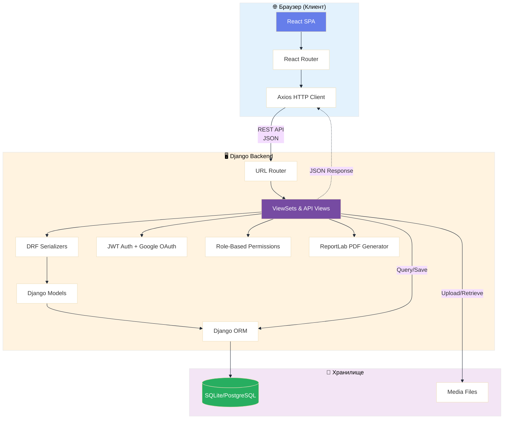

### Поток запроса (Sequence Diagram)

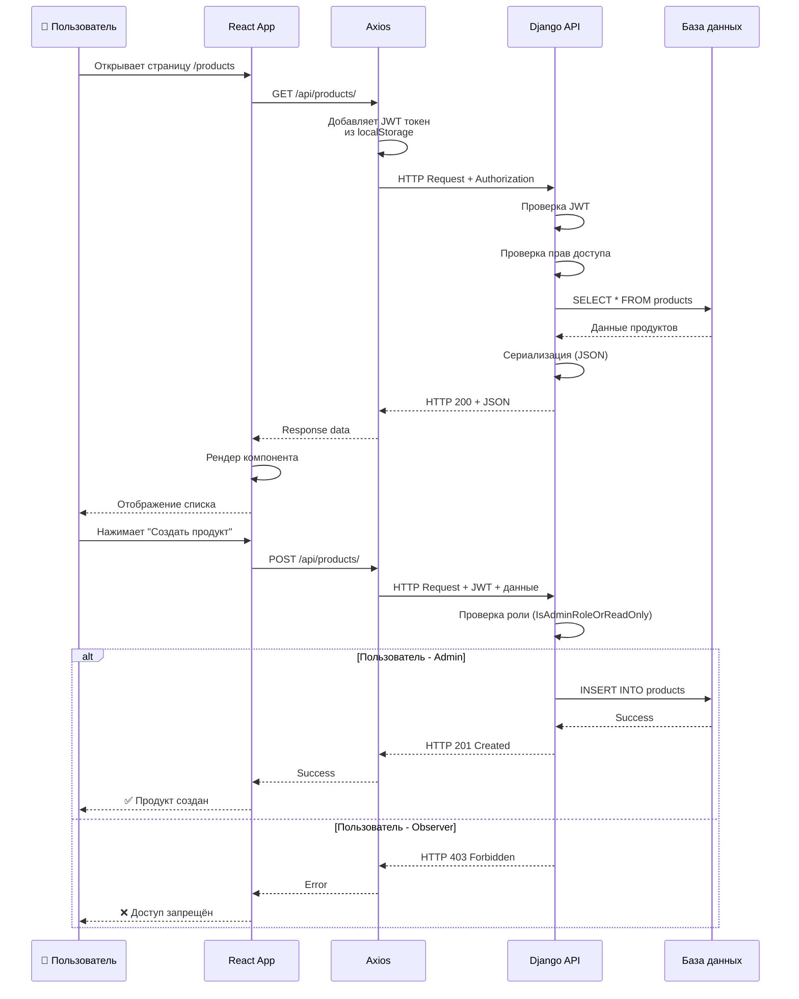

### Архитектура компонентов (Mermaid)

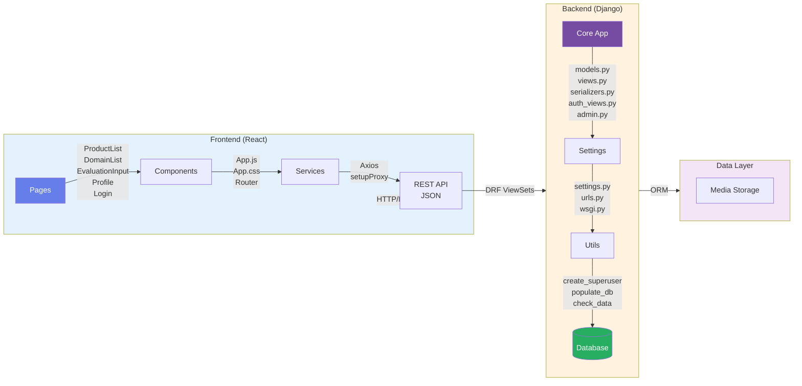

---

## 🗄 Структура базы данных

### ER-диаграмма (сущность-связь)

```
Продукт (1) --------------------< (N) СессияОценки >-------------------- (1) Пользователь [created_by, SET_NULL]
  id PK                               id PK                                         id PK
  name                                product_id FK -> Product.id                  username, email, ...
  description                         created_by_id FK -> User.id (nullable)
  department_owner                    start_date, end_date, status
  product_link
  launch_date
  is_archived

Домен (1) ---------------------< (N) Критерий (1) ------------------------< (N) ШкалаОценки
  id PK                               id PK                                       id PK
  name                                domain_id FK -> Domain.id                   criterion_id FK -> Criterion.id
  description                         name, description, weight                   score (1..10), description
  weight

СессияОценки (1) ----------< (N) НазначенныйКритерий >------------------- (1) Критерий
                                    id PK                                         id PK
                                    evaluation_session_id FK -> EvaluationSession.id
                                    criterion_id FK -> Criterion.id
                                    assigned_to_id FK -> User.id (nullable, SET_NULL)
                                    is_verified
                                    UNIQUE(evaluation_session_id, criterion_id)

НазначенныйКритерий (1) ---------- (1) ОтветОценки
                                   id PK
                                   assigned_criterion_id FK UNIQUE -> AssignedCriterion.id
                                   score_value, metric_value, file_evidence, comment, submitted_at

Пользователь (1) ------------------------ (1) Профиль >------------------------------ (N) Роль
  id PK                              id PK                                        id PK
  username, email, ...               user_id FK UNIQUE -> User.id                 name (admin|expert|owner|observer)
                                    role_id FK -> Role.id (nullable, SET_NULL)
```

### ER-диаграмма (Mermaid)

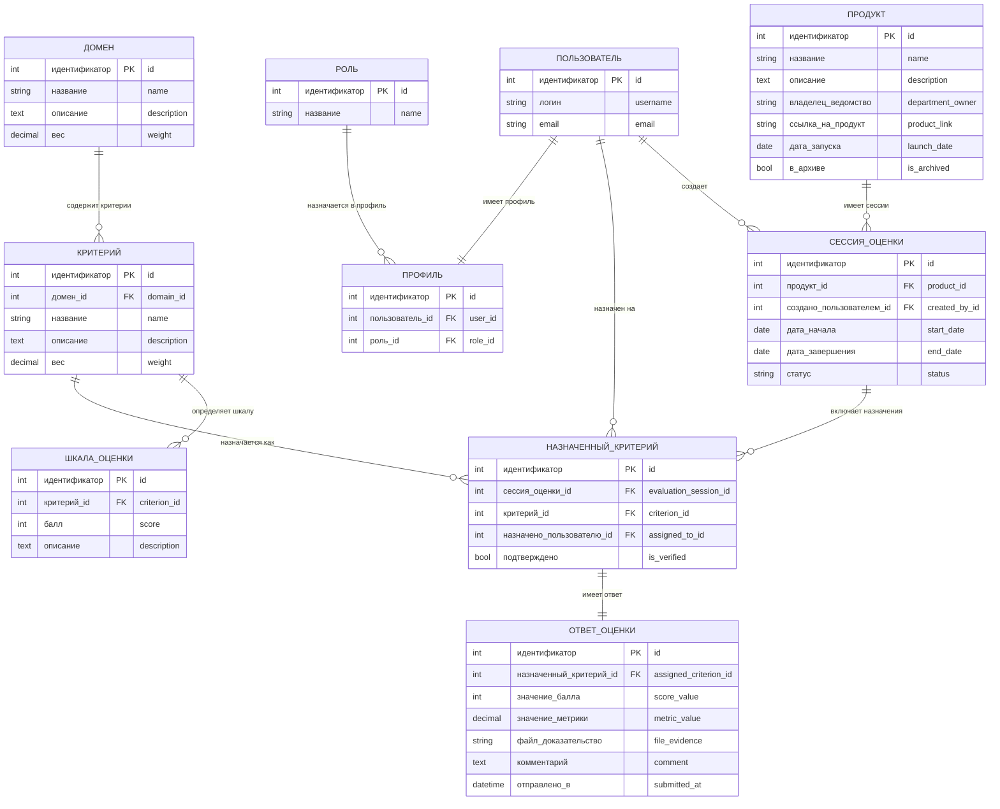

### Кардинальности и правила связей

- `Продукт 1:N СессияОценки` — у продукта может быть много сессий оценки.
- `Домен 1:N Критерий` — каждый критерий принадлежит ровно одному домену.
- `Критерий 1:N ШкалаОценки` — у критерия несколько уровней шкалы.
- `СессияОценки N:M Критерий` реализовано через `НазначенныйКритерий`.
- `НазначенныйКритерий 1:1 ОтветОценки` — на один назначенный критерий максимум один ответ.
- `Пользователь 1:N СессияОценки` через `created_by` (`SET_NULL` при удалении пользователя).
- `Пользователь 1:N НазначенныйКритерий` через `assigned_to` (`SET_NULL` при удалении пользователя).
- `Пользователь 1:1 Профиль` — профиль создается для каждого пользователя.
- `Роль 1:N Профиль` — роль может быть назначена многим пользователям; роль в профиле может быть `NULL`.

### Описание таблиц

#### Продукт (`Product`)
| Поле | Тип | Описание |
|------|-----|----------|
| идентификатор (`id`) | INTEGER | Первичный ключ (AUTO) |
| название (`name`) | VARCHAR(255) | Название продукта |
| описание (`description`) | TEXT | Описание продукта |
| владелец_ведомство (`department_owner`) | VARCHAR(255) | Владелец/ведомство |
| ссылка_на_продукт (`product_link`) | URL | Ссылка на продукт |
| дата_запуска (`launch_date`) | DATE | Дата запуска |
| в_архиве (`is_archived`) | BOOLEAN | Флаг архивации |

#### Домен оценки (`Domain`)
| Поле | Тип | Описание |
|------|-----|----------|
| идентификатор (`id`) | INTEGER | Первичный ключ (AUTO) |
| название (`name`) | VARCHAR(255) | Название домена (уникальное) |
| описание (`description`) | TEXT | Описание домена |
| вес (`weight`) | DECIMAL(5,2) | Вес в общем индексе (0.01-100%) |

#### Критерий оценки (`Criterion`)
| Поле | Тип | Описание |
|------|-----|----------|
| идентификатор (`id`) | INTEGER | Первичный ключ (AUTO) |
| домен_id (`domain_id`) | FK → Domain | Внешний ключ на домен |
| название (`name`) | VARCHAR(255) | Название критерия |
| описание (`description`) | TEXT | Описание критерия |
| вес (`weight`) | DECIMAL(5,2) | Вес в домене (0.01-100%) |

#### Шкала оценки (`RatingScale`)
| Поле | Тип | Описание |
|------|-----|----------|
| идентификатор (`id`) | INTEGER | Первичный ключ (AUTO) |
| критерий_id (`criterion_id`) | FK → Criterion | Внешний ключ на критерий |
| балл (`score`) | INTEGER | Балл (1-10) |
| описание (`description`) | TEXT | Текстовое описание балла |

#### Сессия оценки (`EvaluationSession`)
| Поле | Тип | Описание |
|------|-----|----------|
| идентификатор (`id`) | INTEGER | Первичный ключ (AUTO) |
| продукт_id (`product_id`) | FK → Product | Оцениваемый продукт |
| создано_пользователем (`created_by`) | FK → User | Создатель сессии |
| дата_начала (`start_date`) | DATE | Дата начала (AUTO) |
| дата_завершения (`end_date`) | DATE | Дата завершения |
| статус (`status`) | VARCHAR(50) | ожидает/в_процессе/завершена/в_архиве |

#### Назначенный критерий (`AssignedCriterion`)
| Поле | Тип | Описание |
|------|-----|----------|
| идентификатор (`id`) | INTEGER | Первичный ключ (AUTO) |
| сессия_оценки_id (`evaluation_session_id`) | FK → EvaluationSession | Сессия оценки |
| критерий_id (`criterion_id`) | FK → Criterion | Критерий |
| назначено_пользователю (`assigned_to`) | FK → User | Ответственный |
| подтверждено (`is_verified`) | BOOLEAN | Флаг верификации |

#### Ответ на оценку (`EvaluationAnswer`)
| Поле | Тип | Описание |
|------|-----|----------|
| идентификатор (`id`) | INTEGER | Первичный ключ (AUTO) |
| назначенный_критерий_id (`assigned_criterion_id`) | FK → AssignedCriterion | Назначенный критерий (1:1) |
| значение_балла (`score_value`) | INTEGER | Балл (1-10) |
| значение_метрики (`metric_value`) | DECIMAL(10,2) | Числовая метрика |
| файл_доказательство (`file_evidence`) | FILE | Файл-доказательство |
| комментарий (`comment`) | TEXT | Комментарий |
| отправлено_в (`submitted_at`) | DATETIME | Дата отправки (AUTO) |

#### Роль пользователя (`Role`)
| Поле | Тип | Описание |
|------|-----|----------|
| идентификатор (`id`) | INTEGER | Первичный ключ (AUTO) |
| название (`name`) | VARCHAR(50) | администратор/эксперт/владелец/наблюдатель |

#### Профиль пользователя (`Profile`)
| Поле | Тип | Описание |
|------|-----|----------|
| идентификатор (`id`) | INTEGER | Первичный ключ (AUTO) |
| пользователь_id (`user_id`) | FK → User | Пользователь Django (1:1) |
| роль_id (`role_id`) | FK → Role | Роль пользователя |

### Где строить физическую модель БД

Физическую модель на основе вашей логической модели лучше строить в двух местах:

1. **В коде проекта (основной источник истины)** — через `Django models` и миграции (`python manage.py makemigrations && python manage.py migrate`).
2. **В PostgreSQL-клиенте для визуальной проверки** — например, в pgAdmin 4 (ERD Tool), DBeaver или DataGrip, подключившись к вашей БД и проверив фактические таблицы/индексы/ограничения.

Для текущего проекта:

- **Production БД:** `PostgreSQL` (основная целевая физическая модель).
- **Development БД:** `SQLite` (локальная разработка и быстрый старт).

### Full SQL for Physical Database Model (PostgreSQL, DBeaver visualization)

> Below is a standalone DDL script for visualization in DBeaver with fully English table names, columns, relations, and indexes.  
> Use this script to build an English ERD in a separate PostgreSQL database.

```sql
-- Recommended for PostgreSQL 15+
BEGIN;

-- =========================================================
-- 1) Users and reference entities
-- =========================================================

CREATE TABLE IF NOT EXISTS role (
    id BIGSERIAL PRIMARY KEY,
    name VARCHAR(50) NOT NULL UNIQUE
);

CREATE TABLE IF NOT EXISTS app_user (
    id BIGSERIAL PRIMARY KEY,
    username VARCHAR(150) NOT NULL UNIQUE,
    email VARCHAR(254),
    created_at TIMESTAMPTZ NOT NULL DEFAULT NOW()
);

CREATE TABLE IF NOT EXISTS profile (
    id BIGSERIAL PRIMARY KEY,
    user_id BIGINT NOT NULL UNIQUE
        REFERENCES app_user(id) ON DELETE CASCADE,
    role_id BIGINT
        REFERENCES role(id) ON DELETE SET NULL
);

CREATE TABLE IF NOT EXISTS product (
    id BIGSERIAL PRIMARY KEY,
    name VARCHAR(255) NOT NULL,
    description TEXT,
    department_owner VARCHAR(255),
    product_link TEXT,
    launch_date DATE,
    is_archived BOOLEAN NOT NULL DEFAULT FALSE
);

CREATE TABLE IF NOT EXISTS domain (
    id BIGSERIAL PRIMARY KEY,
    name VARCHAR(255) NOT NULL UNIQUE,
    description TEXT,
    weight NUMERIC(5,2) NOT NULL CHECK (weight > 0 AND weight <= 100)
);

-- =========================================================
-- 2) Criteria and scales
-- =========================================================

CREATE TABLE IF NOT EXISTS criterion (
    id BIGSERIAL PRIMARY KEY,
    domain_id BIGINT NOT NULL
        REFERENCES domain(id) ON DELETE CASCADE,
    name VARCHAR(255) NOT NULL,
    description TEXT,
    weight NUMERIC(5,2) NOT NULL CHECK (weight > 0 AND weight <= 100),
    CONSTRAINT uq_criterion_domain_name
        UNIQUE (domain_id, name)
);

CREATE TABLE IF NOT EXISTS rating_scale (
    id BIGSERIAL PRIMARY KEY,
    criterion_id BIGINT NOT NULL
        REFERENCES criterion(id) ON DELETE CASCADE,
    score INTEGER NOT NULL CHECK (score BETWEEN 1 AND 10),
    description TEXT NOT NULL,
    CONSTRAINT uq_rating_scale_criterion_score
        UNIQUE (criterion_id, score)
);

-- =========================================================
-- 3) Evaluation sessions and assignments
-- =========================================================

CREATE TABLE IF NOT EXISTS evaluation_session (
    id BIGSERIAL PRIMARY KEY,
    product_id BIGINT NOT NULL
        REFERENCES product(id) ON DELETE CASCADE,
    created_by_id BIGINT
        REFERENCES app_user(id) ON DELETE SET NULL,
    start_date DATE NOT NULL DEFAULT CURRENT_DATE,
    end_date DATE,
    status VARCHAR(50) NOT NULL DEFAULT 'pending',
    CONSTRAINT chk_evaluation_status
        CHECK (status IN ('pending', 'in_progress', 'completed', 'archived')),
    CONSTRAINT chk_session_dates
        CHECK (end_date IS NULL OR end_date >= start_date)
);

CREATE TABLE IF NOT EXISTS assigned_criterion (
    id BIGSERIAL PRIMARY KEY,
    evaluation_session_id BIGINT NOT NULL
        REFERENCES evaluation_session(id) ON DELETE CASCADE,
    criterion_id BIGINT NOT NULL
        REFERENCES criterion(id) ON DELETE CASCADE,
    assigned_to_id BIGINT
        REFERENCES app_user(id) ON DELETE SET NULL,
    is_verified BOOLEAN NOT NULL DEFAULT FALSE,
    CONSTRAINT uq_assigned_criterion
        UNIQUE (evaluation_session_id, criterion_id)
);

CREATE TABLE IF NOT EXISTS evaluation_answer (
    id BIGSERIAL PRIMARY KEY,
    assigned_criterion_id BIGINT NOT NULL UNIQUE
        REFERENCES assigned_criterion(id) ON DELETE CASCADE,
    score_value INTEGER CHECK (score_value BETWEEN 1 AND 10),
    metric_value NUMERIC(10,2),
    file_evidence TEXT,
    comment TEXT,
    submitted_at TIMESTAMPTZ NOT NULL DEFAULT NOW()
);

-- =========================================================
-- 4) Indexes for frequent queries
-- =========================================================

CREATE INDEX IF NOT EXISTS idx_criterion_domain_id
    ON criterion(domain_id);

CREATE INDEX IF NOT EXISTS idx_rating_scale_criterion_id
    ON rating_scale(criterion_id);

CREATE INDEX IF NOT EXISTS idx_eval_session_product_id
    ON evaluation_session(product_id);

CREATE INDEX IF NOT EXISTS idx_eval_session_created_by_id
    ON evaluation_session(created_by_id);

CREATE INDEX IF NOT EXISTS idx_assigned_criterion_session_id
    ON assigned_criterion(evaluation_session_id);

CREATE INDEX IF NOT EXISTS idx_assigned_criterion_criterion_id
    ON assigned_criterion(criterion_id);

CREATE INDEX IF NOT EXISTS idx_assigned_criterion_assigned_to_id
    ON assigned_criterion(assigned_to_id);

CREATE INDEX IF NOT EXISTS idx_profile_role_id
    ON profile(role_id);

COMMIT;
```

### Полный SQL-код физической модели БД (PostgreSQL, боевой вариант для Django)

> Ниже — вариант с английскими именами таблиц/полей, совместимый с текущей backend-моделью Django.  
> Используйте его для production-окружения или когда нужна схема, максимально близкая к коду приложения.

```sql
BEGIN;

-- =========================================================
-- 1) Справочники и базовые сущности
-- =========================================================

CREATE TABLE IF NOT EXISTS role (
    id BIGSERIAL PRIMARY KEY,
    name VARCHAR(50) NOT NULL UNIQUE
);

CREATE TABLE IF NOT EXISTS domain (
    id BIGSERIAL PRIMARY KEY,
    name VARCHAR(255) NOT NULL UNIQUE,
    description TEXT,
    weight NUMERIC(5,2) NOT NULL CHECK (weight > 0 AND weight <= 100)
);

CREATE TABLE IF NOT EXISTS product (
    id BIGSERIAL PRIMARY KEY,
    name VARCHAR(255) NOT NULL,
    description TEXT,
    department_owner VARCHAR(255),
    product_link TEXT,
    launch_date DATE,
    is_archived BOOLEAN NOT NULL DEFAULT FALSE
);

-- =========================================================
-- 2) Критерии и шкалы
-- =========================================================

CREATE TABLE IF NOT EXISTS criterion (
    id BIGSERIAL PRIMARY KEY,
    domain_id BIGINT NOT NULL REFERENCES domain(id) ON DELETE CASCADE,
    name VARCHAR(255) NOT NULL,
    description TEXT,
    weight NUMERIC(5,2) NOT NULL CHECK (weight > 0 AND weight <= 100),
    CONSTRAINT uq_criterion_domain_name UNIQUE (domain_id, name)
);

CREATE TABLE IF NOT EXISTS rating_scale (
    id BIGSERIAL PRIMARY KEY,
    criterion_id BIGINT NOT NULL REFERENCES criterion(id) ON DELETE CASCADE,
    score INTEGER NOT NULL CHECK (score BETWEEN 1 AND 10),
    description TEXT NOT NULL,
    CONSTRAINT uq_rating_scale_criterion_score UNIQUE (criterion_id, score)
);

-- =========================================================
-- 3) Сессии оценки и назначения
-- =========================================================

CREATE TABLE IF NOT EXISTS evaluation_session (
    id BIGSERIAL PRIMARY KEY,
    product_id BIGINT NOT NULL REFERENCES product(id) ON DELETE CASCADE,
    created_by_id INTEGER REFERENCES auth_user(id) ON DELETE SET NULL,
    start_date DATE NOT NULL DEFAULT CURRENT_DATE,
    end_date DATE,
    status VARCHAR(50) NOT NULL DEFAULT 'pending',
    CONSTRAINT chk_evaluation_status
        CHECK (status IN ('pending', 'in_progress', 'completed', 'archived')),
    CONSTRAINT chk_session_dates
        CHECK (end_date IS NULL OR end_date >= start_date)
);

CREATE TABLE IF NOT EXISTS assigned_criterion (
    id BIGSERIAL PRIMARY KEY,
    evaluation_session_id BIGINT NOT NULL REFERENCES evaluation_session(id) ON DELETE CASCADE,
    criterion_id BIGINT NOT NULL REFERENCES criterion(id) ON DELETE CASCADE,
    assigned_to_id INTEGER REFERENCES auth_user(id) ON DELETE SET NULL,
    is_verified BOOLEAN NOT NULL DEFAULT FALSE,
    CONSTRAINT uq_assigned_criterion UNIQUE (evaluation_session_id, criterion_id)
);

CREATE TABLE IF NOT EXISTS evaluation_answer (
    id BIGSERIAL PRIMARY KEY,
    assigned_criterion_id BIGINT NOT NULL UNIQUE REFERENCES assigned_criterion(id) ON DELETE CASCADE,
    score_value INTEGER CHECK (score_value BETWEEN 1 AND 10),
    metric_value NUMERIC(10,2),
    file_evidence TEXT,
    comment TEXT,
    submitted_at TIMESTAMPTZ NOT NULL DEFAULT NOW()
);

-- =========================================================
-- 4) Профили пользователей (расширение auth_user)
-- =========================================================

CREATE TABLE IF NOT EXISTS profile (
    id BIGSERIAL PRIMARY KEY,
    user_id INTEGER NOT NULL UNIQUE REFERENCES auth_user(id) ON DELETE CASCADE,
    role_id BIGINT REFERENCES role(id) ON DELETE SET NULL
);

-- =========================================================
-- 5) Индексы для ускорения типовых запросов
-- =========================================================

CREATE INDEX IF NOT EXISTS idx_criterion_domain_id
    ON criterion(domain_id);

CREATE INDEX IF NOT EXISTS idx_rating_scale_criterion_id
    ON rating_scale(criterion_id);

CREATE INDEX IF NOT EXISTS idx_eval_session_product_id
    ON evaluation_session(product_id);

CREATE INDEX IF NOT EXISTS idx_eval_session_created_by_id
    ON evaluation_session(created_by_id);

CREATE INDEX IF NOT EXISTS idx_assigned_criterion_session_id
    ON assigned_criterion(evaluation_session_id);

CREATE INDEX IF NOT EXISTS idx_assigned_criterion_criterion_id
    ON assigned_criterion(criterion_id);

CREATE INDEX IF NOT EXISTS idx_assigned_criterion_assigned_to_id
    ON assigned_criterion(assigned_to_id);

CREATE INDEX IF NOT EXISTS idx_profile_role_id
    ON profile(role_id);

COMMIT;
```

### Tabular Description of the Physical Model (report format)

Below is the table description in the format: **Attribute / Data Type / Key Type / NOT NULL**.

#### Table 4.1 - Description of table `role`
| Attribute | Data Type | Key Type | NOT NULL |
|---|---|---|---|
| id | BIGSERIAL | PK | + |
| name | VARCHAR(50) | UQ | + |

#### Table 4.2 - Description of table `app_user`
| Attribute | Data Type | Key Type | NOT NULL |
|---|---|---|---|
| id | BIGSERIAL | PK | + |
| username | VARCHAR(150) | UQ | + |
| email | VARCHAR(254) | - | - |
| created_at | TIMESTAMPTZ | - | + |

#### Table 4.3 - Description of table `profile`
| Attribute | Data Type | Key Type | NOT NULL |
|---|---|---|---|
| id | BIGSERIAL | PK | + |
| user_id | BIGINT | FK, UQ | + |
| role_id | BIGINT | FK | - |

#### Table 4.4 - Description of table `product`
| Attribute | Data Type | Key Type | NOT NULL |
|---|---|---|---|
| id | BIGSERIAL | PK | + |
| name | VARCHAR(255) | - | + |
| description | TEXT | - | - |
| department_owner | VARCHAR(255) | - | - |
| product_link | TEXT | - | - |
| launch_date | DATE | - | - |
| is_archived | BOOLEAN | - | + |

#### Table 4.5 - Description of table `domain`
| Attribute | Data Type | Key Type | NOT NULL |
|---|---|---|---|
| id | BIGSERIAL | PK | + |
| name | VARCHAR(255) | UQ | + |
| description | TEXT | - | - |
| weight | NUMERIC(5,2) | CHECK | + |

#### Table 4.6 - Description of table `criterion`
| Attribute | Data Type | Key Type | NOT NULL |
|---|---|---|---|
| id | BIGSERIAL | PK | + |
| domain_id | BIGINT | FK | + |
| name | VARCHAR(255) | UQ* | + |
| description | TEXT | - | - |
| weight | NUMERIC(5,2) | CHECK | + |

\* Unique as a pair (`domain_id`, `name`).

#### Table 4.7 - Description of table `rating_scale`
| Attribute | Data Type | Key Type | NOT NULL |
|---|---|---|---|
| id | BIGSERIAL | PK | + |
| criterion_id | BIGINT | FK | + |
| score | INTEGER | UQ*, CHECK | + |
| description | TEXT | - | + |

\* Unique as a pair (`criterion_id`, `score`).

#### Table 4.8 - Description of table `evaluation_session`
| Attribute | Data Type | Key Type | NOT NULL |
|---|---|---|---|
| id | BIGSERIAL | PK | + |
| product_id | BIGINT | FK | + |
| created_by_id | BIGINT | FK | - |
| start_date | DATE | - | + |
| end_date | DATE | CHECK | - |
| status | VARCHAR(50) | CHECK | + |

#### Table 4.9 - Description of table `assigned_criterion`
| Attribute | Data Type | Key Type | NOT NULL |
|---|---|---|---|
| id | BIGSERIAL | PK | + |
| evaluation_session_id | BIGINT | FK, UQ* | + |
| criterion_id | BIGINT | FK, UQ* | + |
| assigned_to_id | BIGINT | FK | - |
| is_verified | BOOLEAN | - | + |

\* Unique as a pair (`evaluation_session_id`, `criterion_id`).

#### Table 4.10 - Description of table `evaluation_answer`
| Attribute | Data Type | Key Type | NOT NULL |
|---|---|---|---|
| id | BIGSERIAL | PK | + |
| assigned_criterion_id | BIGINT | FK, UQ | + |
| score_value | INTEGER | CHECK | - |
| metric_value | NUMERIC(10,2) | - | - |
| file_evidence | TEXT | - | - |
| comment | TEXT | - | - |
| submitted_at | TIMESTAMPTZ | - | + |

### Пояснительная записка: типы ключей и типы данных

#### Что означает тип ключа

| Обозначение | Расшифровка | Что означает на практике |
|---|---|---|
| PK | Primary Key (первичный ключ) | Уникальный идентификатор строки в таблице. Не повторяется и не может быть `NULL`. |
| FK | Foreign Key (внешний ключ) | Ссылка на запись в другой таблице. Обеспечивает целостность связей между таблицами. |
| UQ | Unique (уникальное ограничение) | Значения в колонке (или комбинации колонок) не должны повторяться. |
| CHECK | Проверочное ограничение | Ограничивает допустимые значения по условию (например, диапазон балла, допустимые статусы). |

#### Что означает тип данных

| Тип данных | Что хранит | Пример |
|---|---|---|
| BIGSERIAL | Большое автоинкрементное целое число (обычно для `id`) | 1, 2, 3, ... |
| BIGINT | Большое целое число | 1250 |
| INTEGER | Целое число | 10 |
| VARCHAR(50), VARCHAR(150), VARCHAR(255) | Строка фиксированной максимальной длины | `администратор`, `product_owner` |
| TEXT | Текст произвольной длины | Развернутое описание или комментарий |
| NUMERIC(5,2) | Точное десятичное число: всего 5 знаков, из них 2 после запятой | `75.50` |
| NUMERIC(10,2) | Точное десятичное число: всего 10 знаков, из них 2 после запятой | `123456.78` |
| DATE | Календарная дата без времени | `2026-04-29` |
| BOOLEAN | Логическое значение | `TRUE` / `FALSE` |
| TIMESTAMPTZ | Дата и время с часовым поясом | `2026-04-29 19:05:00+03` |

#### Дополнительно по колонке `NOT NULL`

- `+` означает, что поле обязательно к заполнению (значение `NULL` запрещено).
- `-` означает, что поле может быть пустым (`NULL` разрешен).

---

## 🛠 Стек технологий

### Backend

| Технология | Версия | Назначение |
|------------|--------|------------|
| **Python** | 3.11+ | Язык программирования |
| **Django** | 4.2+ | Web-фреймворк |
| **Django REST Framework** | 3.14+ | REST API |
| **djangorestframework-simplejwt** | 5.3+ | JWT аутентификация |
| **django-cors-headers** | 4.3+ | CORS для API |
| **django-allauth** | 0.58+ | Расширенная аутентификация |
| **dj-rest-auth** | 5.0+ | REST API для auth |
| **ReportLab** | 4.0+ | Генерация PDF |
| **SQLite** | 3 | БД для разработки |
| **PostgreSQL** | 15+ | БД для production |
| **Gunicorn** | 21+ | WSGI сервер |

### Frontend

| Технология | Версия | Назначение |
|------------|--------|------------|
| **React** | 18+ | UI библиотека |
| **React Router DOM** | 6+ | Маршрутизация SPA |
| **Axios** | 1.6+ | HTTP клиент |
| **Chart.js** | 4+ | Библиотека графиков |
| **react-chartjs-2** | 5+ | React обёртка для Chart.js |
| **Font Awesome** | 6+ | Иконки |
| **CSS3** | - | Стилизация (градиенты, анимации) |

### DevOps / Инфраструктура

| Технология | Назначение |
|------------|------------|
| **Docker** | Контейнеризация |
| **Docker Compose** | Оркестрация контейнеров |
| **Git** | Контроль версий |
| **GitHub** | Хостинг репозитория |
| **npm** | Пакетный менеджер (frontend) |
| **pip** | Пакетный менеджер (backend) |

### Архитектурные паттерны

| Паттерн | Применение |
|---------|------------|
| **MVC/MVT** | Django (Model-View-Template) |
| **REST API** | Взаимодействие frontend-backend |
| **SPA** | Single Page Application (React) |
| **JWT** | Stateless аутентификация |
| **ORM** | Django ORM для работы с БД |
| **Signals** | Django signals для событий |
| **ViewSet** | DRF ViewSets для CRUD API |

---

## 📁 Структура проекта

```
digital_product_maturity_system/
├── backend/
│   ├── digital_product_maturity_project/
│   │   ├── digital_product_maturity/
│   │   │   ├── core/                    # Основное приложение
│   │   │   │   ├── migrations/          # Миграции БД
│   │   │   │   ├── __init__.py
│   │   │   │   ├── admin.py             # Django Admin
│   │   │   │   ├── apps.py              # Конфигурация приложения
│   │   │   │   ├── auth_views.py        # Аутентификация API
│   │   │   │   ├── models.py            # Модели данных (8 моделей)
│   │   │   │   ├── serializers.py       # DRF сериализаторы
│   │   │   │   ├── signals.py           # Django signals
│   │   │   │   ├── urls.py              # URL маршруты API
│   │   │   │   └── views.py             # ViewSets и actions
│   │   │   ├── __init__.py
│   │   │   ├── asgi.py
│   │   │   ├── settings.py              # Настройки Django
│   │   │   ├── urls.py                  # Главные URL
│   │   │   └── wsgi.py
│   │   ├── manage.py
│   │   ├── create_superuser.py          # Создание админа
│   │   ├── populate_db.py               # Наполнение тестовыми данными
│   │   └── check_data.py                # Проверка данных
│   ├── requirements.txt                 # Python зависимости
│   ├── Dockerfile
│   └── .dockerignore
├── frontend/
│   ├── public/
│   │   ├── index.html
│   │   ├── favicon.ico
│   │   └── manifest.json
│   ├── src/
│   │   ├── pages/                       # Страницы приложения
│   │   │   ├── ProductList.js           # Список продуктов
│   │   │   ├── ProductForm.js           # Форма продукта
│   │   │   ├── ProductDetail.js         # Детали продукта
│   │   │   ├── DomainList.js            # Список доменов
│   │   │   ├── DomainForm.js            # Форма домена
│   │   │   ├── CriterionList.js         # Список критериев
│   │   │   ├── CriterionForm.js         # Форма критерия
│   │   │   ├── EvaluationSessionList.js # Список сессий
│   │   │   ├── EvaluationSessionForm.js # Создание сессии
│   │   │   ├── EvaluationInput.js       # Ввод оценок
│   │   │   ├── EvaluationResults.js     # Результаты + графики
│   │   │   ├── Login.js                 # Вход
│   │   │   ├── Register.js              # Регистрация
│   │   │   └── Profile.js               # Профиль
│   │   ├── components/
│   │   │   └── RatingScaleForm.js
│   │   ├── App.js                       # Главный компонент
│   │   ├── App.css                      # Глобальные стили
│   │   ├── index.js                     # Точка входа
│   │   └── setupProxy.js                # Proxy для API
│   ├── package.json
│   ├── Dockerfile
│   └── .dockerignore
├── docker-compose.yml                   # Docker конфигурация
├── start_local.bat                      # Скрипт локального запуска
├── .gitignore
└── README.md
```

---

## 🔌 API Endpoints

| Метод | URL | Описание |
|-------|-----|----------|
| GET/POST | `/api/products/` | Список/создание продуктов |
| GET/PUT/DELETE | `/api/products/{id}/` | Операции с продуктом |
| GET/POST | `/api/domains/` | Список/создание доменов |
| GET/POST | `/api/criteria/` | Список/создание критериев |
| GET/POST | `/api/rating-scales/` | Шкалы оценки |
| GET/POST | `/api/evaluation-sessions/` | Сессии оценки |
| GET | `/api/evaluation-sessions/{id}/get_overall_maturity_index/` | Индекс зрелости |
| GET | `/api/evaluation-sessions/{id}/get_domain_scores/` | Оценки по доменам |
| GET | `/api/evaluation-sessions/{id}/generate_maturity_passport/` | PDF паспорт |
| GET/POST | `/api/assigned-criteria/` | Назначенные критерии |
| GET/POST | `/api/evaluation-answers/` | Ответы на оценку |
| POST | `/api/auth/login/` | Вход |
| POST | `/api/auth/register/` | Регистрация |
| GET | `/api/auth/user/` | Текущий пользователь |

---

## 📈 Расчёт индекса зрелости

```
Индекс домена = Σ(оценка_критерия × вес_критерия) / Σ(веса_критериев)

Общий индекс = Σ(индекс_домена × вес_домена) / Σ(веса_доменов)
```

**Уровни зрелости:**
- 🌟 **Превосходный** (8-10)
- ⭐ **Высокий** (6-8)
- 💫 **Средний** (4-6)
- ⚠️ **Низкий** (2-4)
- ❌ **Критический** (0-2)

---

## 🔄 Бизнес-процесс оценки зрелости

Ниже представлены две модели одного и того же бизнес-процесса — **AS-IS** (как было до внедрения системы) и **TO-BE** (как стало после автоматизации). Диаграммы выполнены в нотации, близкой к BPMN, и рендерятся прямо в GitHub благодаря Mermaid.

Условные обозначения:

- `((...))` — события (start / end)
- `[...]` — задачи (tasks)
- `{...}` — шлюзы / условия (gateways)
- `[/.../]` — документы и данные (artifacts)
- `[(...)]` — БД / хранилища

---

### 📜 Модель AS-IS — ручной процесс «по бумаге и Excel»

Классическая последовательная схема: анкеты рассылаются вручную, данные сводятся в Excel, графики строятся отдельно, отчёты собираются в Word/PowerPoint, согласование — через совещания. Высокая трудоёмкость, риск ошибок, отсутствие версионности и единого источника правды.

```mermaid
%%{init: {'theme':'default', 'themeVariables': {'background':'#ffffff'}}}%%
flowchart TD
    classDef event fill:#cfe8ff,stroke:#3a7bd5,stroke-width:2px,color:#0b3d91
    classDef task fill:#ffffff,stroke:#4a4a4a,stroke-width:1.5px,color:#1f2937
    classDef gw fill:#fff4c2,stroke:#c69500,stroke-width:1.5px,color:#5b4400
    classDef doc fill:#fde2e4,stroke:#c0392b,stroke-width:1.5px,color:#7a1d12
    classDef pain fill:#ffd6d6,stroke:#c0392b,stroke-width:2px,color:#7a1d12,stroke-dasharray: 4 3

    Start((Старт цикла оценки)):::event

    subgraph S1["1. Планирование и подготовка"]
        T11[1.1 Утвердить план оценки]:::task
        T12[1.2 Составить список продуктов]:::task
        T13[1.3 Подготовить бумажные анкеты в Word]:::task
    end

    subgraph S2["2. Сбор исходных данных"]
        T21[2.1 Разослать анкеты владельцам по e-mail]:::task
        T22[2.2 Собрать заполненные анкеты]:::task
        T23[2.3 Проверить полноту данных]:::task
        G2{Все анкеты заполнены?}:::gw
    end

    subgraph S3["3. Обработка и анализ"]
        T31[3.1 Перенести данные в Excel вручную]:::task
        T32[3.2 Рассчитать показатели формулами]:::task
        T33[3.3 Построить графики в Excel]:::task
        Pain1[/Высокий риск ошибок копипаста/]:::pain
    end

    subgraph S4["4. Подготовка отчётности"]
        T41[4.1 Составить текстовый отчёт в Word]:::task
        T42[4.2 Создать презентацию в PowerPoint]:::task
        T43[4.3 Сформулировать рекомендации]:::task
    end

    subgraph S5["5. Согласование и утверждение"]
        T51[5.1 Провести рабочее совещание]:::task
        T52[5.2 Внести корректировки]:::task
        G5{Отчёт утверждён?}:::gw
    end

    subgraph S6["6. Распространение и архивация"]
        T61[6.1 Разослать отчёты по e-mail]:::task
        T62[6.2 Архивировать материалы в сетевой папке]:::task
    end

    End((Завершение цикла)):::event

    Start --> T11 --> T12 --> T13 --> T21 --> T22 --> T23 --> G2
    G2 -- Нет, ждём --> T22
    G2 -- Да --> T31 --> T32 --> T33 --> Pain1 --> T41 --> T42 --> T43 --> T51 --> T52 --> G5
    G5 -- Нет, на доработку --> T31
    G5 -- Да --> T61 --> T62 --> End
```

**Болевые точки AS-IS:**

- Ручной перенос данных из анкет в Excel — типичный источник ошибок.
- Графики строятся каждый цикл заново, шаблоны теряются.
- Нет ролевого разграничения — все правят один и тот же Excel.
- Долгий цикл согласования: каждая правка означает повторный круг расчётов.
- Отсутствие истории изменений и сравнения «период к периоду».
- Распространение отчётов через e-mail — риск работы с устаревшей версией.

---

### 🚀 Модель TO-BE — автоматизированный процесс в системе

В новой модели большая часть рутинных шагов либо исчезает, либо становится автоматической. Ключевые улучшения:

1. **Каталог продуктов** ведётся в одном месте, версионно.
2. **Анкеты** заменены онлайн-формой оценки с валидацией и автосохранением.
3. **Расчёт интегрального индекса и доменных оценок** — автоматический после каждого ответа.
4. **Графики и PDF-паспорт зрелости** генерируются по кнопке.
5. **Ролевая модель** (Администратор / Эксперт-Аудитор / Владелец продукта / Наблюдатель) обеспечивает разграничение прав.
6. **Параллельная работа** нескольких экспертов и владельцев над разными доменами.
7. **Автоматические уведомления и напоминания** о просроченных анкетах.
8. **Цифровое утверждение** отчёта без бумажного совещания.
9. **Аудит-лог** всех действий и сравнение результатов с предыдущим периодом.

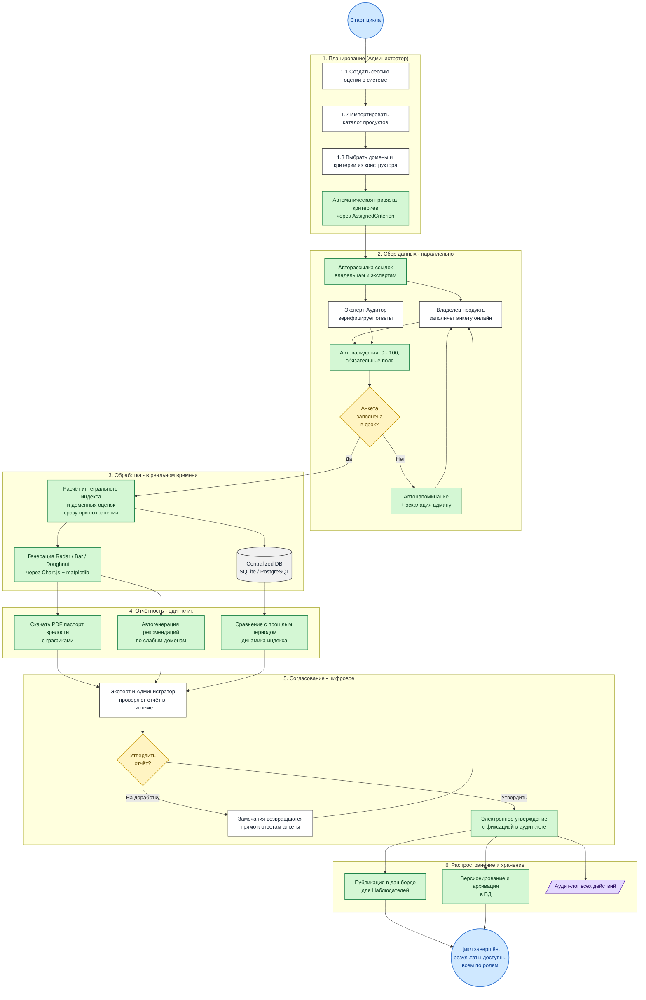

---

### 📊 Сравнение AS-IS и TO-BE

| Этап | AS-IS (как было) | TO-BE (как стало) | Эффект |
|---|---|---|---|
| 1. Планирование | План в Word, список в Excel, анкеты вручную | Сессия и привязка критериев — в конструкторе системы | Время подготовки ↓ в 3-5 раз |
| 2. Сбор данных | E-mail + бумажные / Word-анкеты, последовательно | Онлайн-форма, валидация, параллельно несколько ролей | Скорость сбора ↑, ошибок ↓ |
| 3. Обработка | Ручной перенос в Excel, формулы вручную | Расчёт индексов и графиков автоматически | Ошибки расчёта → 0 |
| 4. Отчётность | Word + PowerPoint, графики копируются картинками | PDF-паспорт с графиками генерируется по кнопке | Минуты вместо дней |
| 5. Согласование | Очное совещание, правки по почте | Цифровое утверждение, замечания привязаны к ответам | Цикл согласования ↓ |
| 6. Распространение | Рассылка по e-mail, версии расходятся | Дашборд для наблюдателей + аудит-лог | Единый источник правды |
| Ролевая модель | Нет, все правят один файл | Admin / Expert / Owner / Observer | Прозрачность и безопасность |
| История | Папки с датами на сетевом диске | Версионирование в БД, сравнение периодов | Возможность анализа динамики |

**Что предложено сверх исходного процесса (улучшения):**

- 🔁 **Параллельная работа** владельцев и экспертов на этапе сбора (раньше шла строго последовательно).
- 🔔 **Автонапоминания и эскалация админу** при просрочке заполнения анкет.
- ✅ **Электронное утверждение** в системе вместо очного совещания.
- 📈 **Сравнение с предыдущим периодом** прямо в отчёте — видно динамику зрелости.
- 💡 **Автогенерация рекомендаций** по доменам с низкой оценкой.
- 🛡 **Аудит-лог** действий — кто, когда, что изменил.
- 👀 **Дашборд для наблюдателей** — без необходимости ручной рассылки.

---

## 📡 Информационное обеспечение бизнес-процессов

В этом разделе показано, какими данными обмениваются участники процесса и где эти данные хранятся. Все диаграммы выполнены на Mermaid и отрисовываются прямо в GitHub.

Условные обозначения (приближены к нотации Гейна-Сарсона / Йордона):

- **Прямоугольник** `[Внешняя сущность]` — источник или приёмник данных вне системы (роль, внешний сервис).
- **Скруглённый блок** `(Процесс)` — обработчик данных внутри системы.
- **Цилиндр** `[(Хранилище данных)]` — таблица БД или физическое хранилище.
- **Стрелки с подписью** — поток данных и его содержание.

---

### 🌐 Контекстная диаграмма (DFD Level 0)

Система оценки зрелости показана одним процессом, взаимодействующим с пользователями и внешними сервисами. Видно «what goes in / what goes out».

**Описание потоков данных:**
1. **От Владельца продукта в систему:** анкетные данные, числовые метрики, файлы-доказательства.
2. **От системы к Владельцу:** уведомления о необходимости заполнения, запросы на уточнение, паспорт зрелости.
3. **От Эксперта:** решения о верификации, комментарии, запросы изменений.
4. **От системы к Эксперту:** список сессий на проверку, данные ответов.
5. **От Администратора:** настройки модели (домены, критерии, веса), реестр продуктов.
6. **От системы к Администратору:** отчёты о ходе оценки, статистика.
7. **От системы к Руководству:** сводные дашборды, аналитические отчёты.
8. **Обмен с внешними системами:** импорт метрик доступности, DAU, обратной связи.

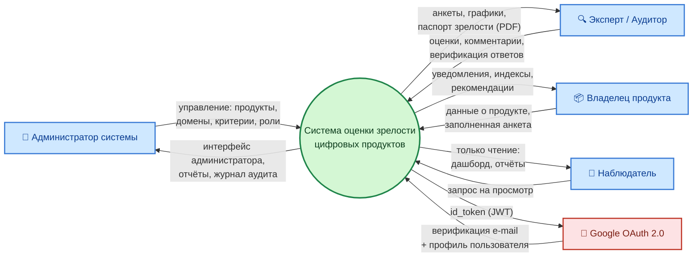

---

### 🧭 DFD Level 1 — декомпозиция системы

Диаграмма DFD уровня 1 детализирует основные процессы, хранилища данных и потоки внутри системы. Показано, какие потоки идут между процессами и какие данные читаются/пишутся в БД.

**Выделены следующие процессы:**
- **Процесс 1 «Управление реестром продуктов»** – добавление, редактирование, архивация цифровых продуктов.
- **Процесс 2 «Настройка модели оценки»** – создание доменов, критериев, шкал и весов.
- **Процесс 3 «Инициация и проведение оценки»** – создание сессии, назначение ответственных, заполнение анкет.
- **Процесс 4 «Верификация результатов»** – проверка данных экспертом, утверждение или отправка на доработку.
- **Процесс 5 «Расчёт индексов и визуализация»** – автоматический расчёт баллов, интегральных показателей, построение дашбордов.
- **Процесс 6 «Генерация отчётности»** – формирование PDF-паспортов и сводных отчётов.

**Основные хранилища данных (сущности):**
- **D1** – Реестр продуктов
- **D2** – Модель зрелости (домены, критерии, шкалы)
- **D3** – Данные оценочных сессий
- **D4** – Ответы по критериям
- **D5** – Отчёты

**Пример потока:** Владелец продукта → (заполненная анкета) → Процесс 3 → (сохранение ответов) → D4. Затем Эксперт → (запрос на верификацию) → Процесс 4 → (чтение из D4) → Процесс 4 → (утверждённые данные) → Процесс 5 → (расчёт) → D5 → Процесс 6 → (отчёт) → Руководство.

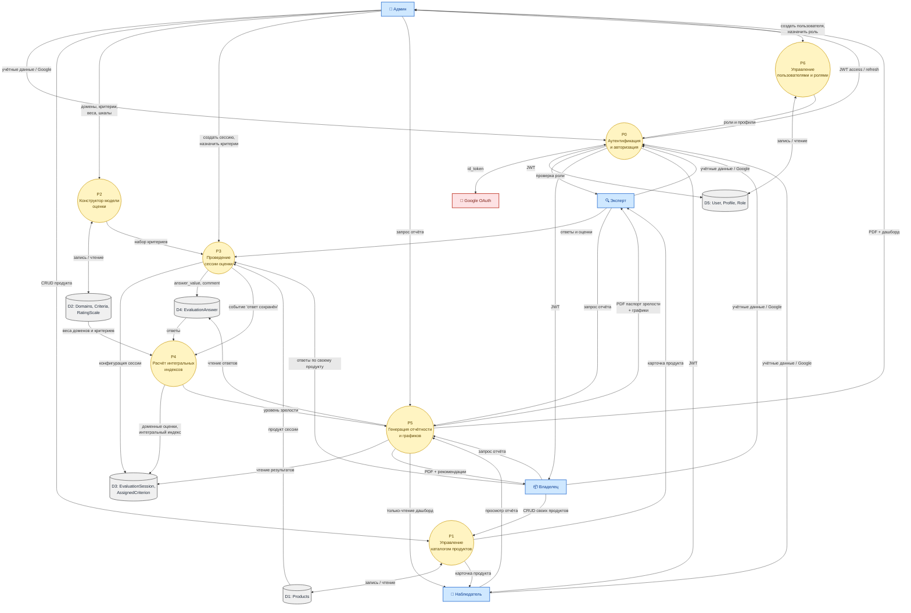

---

### 🔁 Контекстная диаграмма потоков данных по ролям

Удобный «срез» — те же потоки, но сгруппированные с точки зрения каждой роли. Хорошо видно, что наблюдатель только читает, а админ имеет полный двунаправленный обмен.

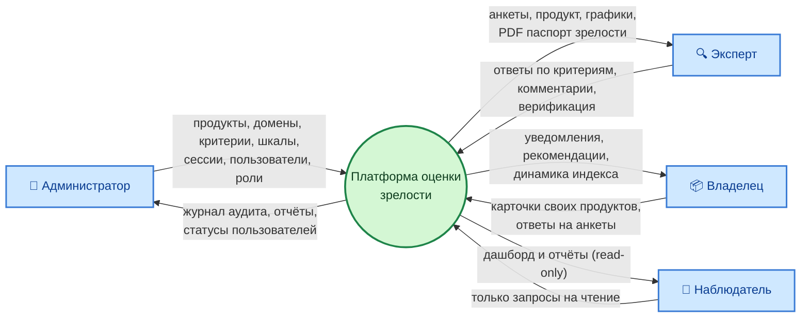

---

### 🛤 Диаграмма workflow одной сессии оценки (процесса координации)

Для описания логики взаимодействия участников при проведении оценки разработана диаграмма workflow, отражающая состояния сессии и переходы между ними. Жизненный цикл одного экземпляра «сессия оценки продукта» — от создания до архивации. Workflow построен на основе ролевой модели (ФТ-07). Полезно для понимания, в каком состоянии данные доступны для чтения/записи.

**Состояния сессии:**
1. **«Черновик»** – сессия создана администратором, назначены ответственные, но данные не введены.
2. **«Ожидает заполнения»** – владельцу продукта отправлено уведомление, он может вносить ответы.
3. **«На верификации»** – владелец завершил заполнение (отправил на проверку). Эксперт получает задание.
4. **«Запрос изменений»** – эксперт обнаружил несоответствия и отправил сессию на доработку владельцу.
5. **«Завершена»** – эксперт утвердил все ответы, система рассчитала индексы и сгенерировала отчёты.

**Переходы:**
- Администратор → инициация → Черновик
- Черновик → назначение ответственных → Ожидает заполнения
- Ожидает заполнения → владелец заполнил → На верификации
- На верификации → эксперт отклонил → Запрос изменений
- Запрос изменений → владелец исправил → На верификации
- На верификации → эксперт утвердил → Завершена

Для каждого перехода в системе предусмотрены автоматические уведомления (электронная почта, внутрисистемные оповещения) и логирование действий.

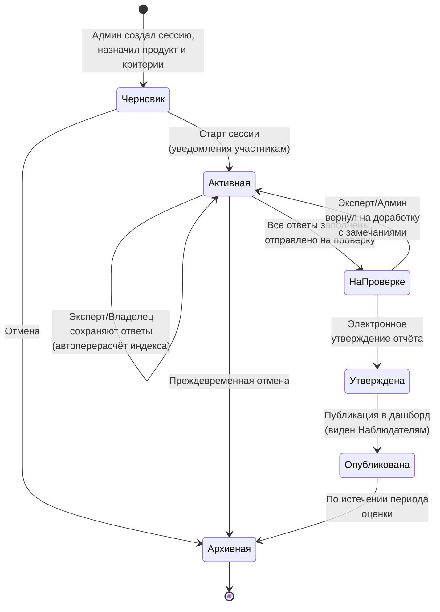

---

### 📥 Сводная таблица потоков данных (Data Dictionary, кратко)

| # | Поток данных | От | К | Содержимое | Хранилище |
|---|---|---|---|---|---|
| F1 | Учётные данные | Любая роль | P0 Auth | `username`, `password` или `id_token` | — |
| F2 | JWT-токен | P0 Auth | Любая роль | `access_token`, `refresh_token` | — |
| F3 | CRUD продукта | Admin / Owner | P1 | `name`, `description`, `department_owner`, `link` | D1: Products |
| F4 | Карточка продукта | P1 | Все роли | Атрибуты Product + список сессий | D1 |
| F5 | Модель оценки | Admin | P2 | Домены (с весами), критерии (с весами), шкалы | D2 |
| F6 | Конфигурация сессии | Admin | P3 | `product_id`, `start_date`, набор `AssignedCriterion` | D3 |
| F7 | Ответ на критерий | Expert / Owner | P3 | `assigned_criterion_id`, `metric_value (0-100)`, `comment` | D4 |
| F8 | Доменные оценки | P4 | P3 / P5 | `{domain → score}`, `overall_index` | D3 (расчётно) |
| F9 | PDF паспорт зрелости | P5 | Любая роль | 3 страницы: титул + графики + детализация | — (стрим) |
| F10 | Аудит | Все процессы | D5 / журнал | `who`, `when`, `what`, `before/after` | D5 |

---

## 📅 Диаграмма Ганта (план дипломного проекта)

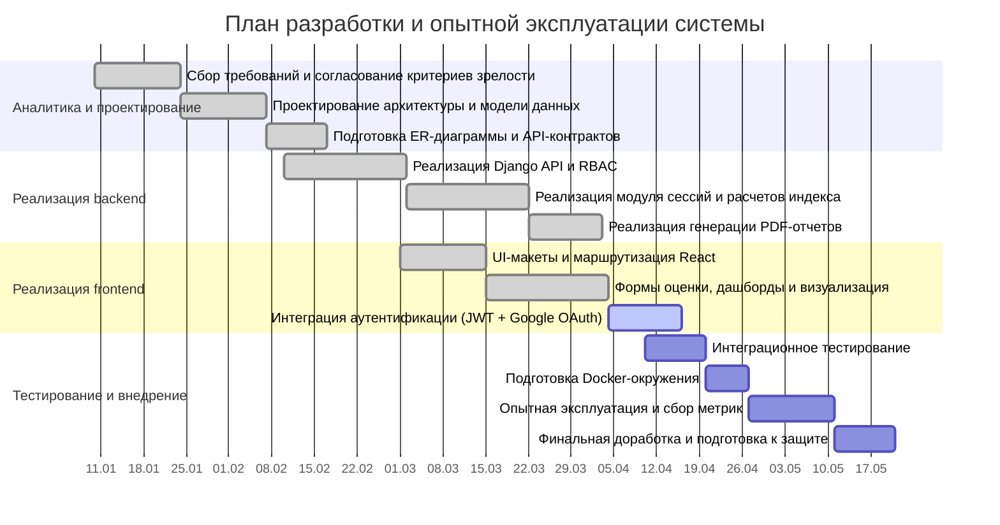

## 📈 Мониторинг и централизованное логирование (опытная эксплуатация)

На этапе опытной эксплуатации используется стек:

- **Prometheus + Grafana** — сбор и визуализация метрик серверов и приложения.
- **ELK Stack (Elasticsearch + Logstash + Kibana)** — централизованный сбор и анализ логов.

Состав контейнеров в `docker-compose.yml`:

- Метрики: `prometheus`, `grafana`, `node-exporter`, `cadvisor`, `postgres-exporter`
- Логи: `elasticsearch`, `logstash`, `filebeat`, `kibana`

### Точки доступа

- Frontend: `http://localhost:3000`
- Backend API: `http://localhost:8000/api/`
- Prometheus: `http://localhost:9090`
- Grafana: `http://localhost:3001` (`admin` / `admin`)
- Elasticsearch: `http://localhost:9200`
- Kibana: `http://localhost:5601`

### Готовые дашборды после запуска

- **Grafana (автоматически):**
  - datasource `Prometheus` создается автоматически;
  - dashboard `Diploma Project - System Overview` появляется в папке `Diploma Monitoring`.
- **Kibana (автоматически):**
  - создается Data View `app-logs-*` (название `Application Logs`);
  - можно сразу открыть Discover и строить визуализации/дашборды по логам.

### Запуск полного стенда (приложение + мониторинг + ELK)

```bash
docker-compose up --build
```

После запуска:

1. В Grafana добавьте datasource `Prometheus` с URL `http://prometheus:9090`.
2. В Kibana создайте data view для индексов `app-logs-*`.
3. Проверьте endpoint метрик приложения: `http://localhost:8000/metrics`.

---

## 🚀 Быстрый старт

### Локальный запуск

```bash
# Backend
cd backend/digital_product_maturity_project
pip install -r ../requirements.txt
python manage.py migrate
python create_superuser.py
python populate_db.py
python manage.py runserver

# Frontend (в другом терминале)
cd frontend
npm install
npm start
```

### Docker Compose

```bash
docker-compose up --build
```

**Доступ:**
- Frontend: http://localhost:3000
- Backend API: http://localhost:8000/api/
- Логин: `admin` / Пароль: `admin123`

---

## 📄 Лицензия

MIT License

## 👨‍💻 Автор

Система разработана для оценки зрелости цифровых продуктов региона.
